  

 

Final-year IT student at Faculdade de Ciências da Universidade de Lisboa
(FCUL), focused on AI/LLM integration and full-stack engineering. I build
things end to end — backend, frontend, infra, and the operational mess that
comes with actually running them — rather than stopping at a working demo.

Open to junior / internship roles in AI, data, or software engineering.

## Featured project

### [Video Downloader + AI Summarizer](https://github.com/OJsan-ForReal/video-downloader-ai-summarizer)

A video downloader (yt-dlp, 1800+ sites) with an AI layer on top: streaming
summaries, auto-generated mind maps, and a Q&A chat grounded in the video's
content. Also a full account system, Stripe subscriptions, three-language
i18n, and a privacy-conscious admin analytics dashboard.

The README covers a real production incident debugged end to end (a
three-layer email-deliverability failure) and a zero-budget workaround for
datacenter-IP blocking built from a spare Android phone and a reverse SSH
tunnel.

`FastAPI` `React` `SQLAlchemy` `OpenRouter` `Stripe` `fastapi-users` `SSE`

*Private repo — happy to grant access, just ask.*

## Other projects

**UrbanWheels** — Fleet management / ride-sharing platform. Django REST
Framework (10 apps) + PostgreSQL backend, Vue 3 frontend with real map
routing (OSRM/Nominatim), Stripe payments, deployed on GCP with an
active/passive Nginx + keepalived (VRRP) setup for high availability.
*Academic project, private repo.*

**WeatherWise** — Spring Boot REST API serving weather forecasts by
location and date from existing data, built as a companion service to a
bike-sharing platform: a JavaFX desktop client calls it to show the
forecast at a station when reserving a bike, alongside a Thymeleaf admin
web UI for fleet management. Layered architecture
(Controller/Service/Repository), Dockerized. *Academic group project (max
3 students), Construção de Sistemas de Software @ FCUL, hosted on the
university's GitLab, not public.*

**[Grade Prediction](https://github.com/OJsan-ForReal/FAA-G22)** —
Classification/regression pipelines (scikit-learn) predicting exam outcomes
from behavioral data; compared 5 feature-selection methods across 5 model
families, SHAP for interpretability, K-Means for behavioral segmentation.
*Group project (3 members), FCUL.*

**mySaude** — Secure file exchange, client/server in Java. Hybrid encryption
(AES-128 + RSA-2048), digital signatures (SHA256withRSA), PKCS12 keystores.
*Academic project, private repo.*

**[Flipcard Memory Game](https://github.com/OJsan-ForReal/FLIPCARD_GAME)** —
Browser-based memory/matching game, vanilla HTML/CSS/JS. Solo, 1v1, and
trio multiplayer modes, timed play, and a Pokémon-themed skin.
*Group project (3 members), FCUL — in development.*

## Stack

**AI & LLMs** `OpenRouter` `OpenAI SDK` `SSE streaming` `model fallback chains`

**Backend & Data** `FastAPI` `Django REST Framework` `PostgreSQL` `Java` `scikit-learn` `pandas`

**Frontend & Cloud** `React` `Vue 3` `Docker` `nginx` `GCP` `Azure`

**Security** `AES/RSA` `PKI` `iptables` `nmap`

## Contact

[oujiesan30@gmail.com](mailto:oujiesan30@gmail.com) · [LinkedIn](https://www.linkedin.com/in/oujie-wu-a1900a3ba/) · Lisboa, Portugal
